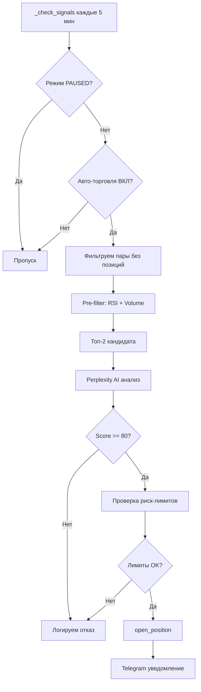
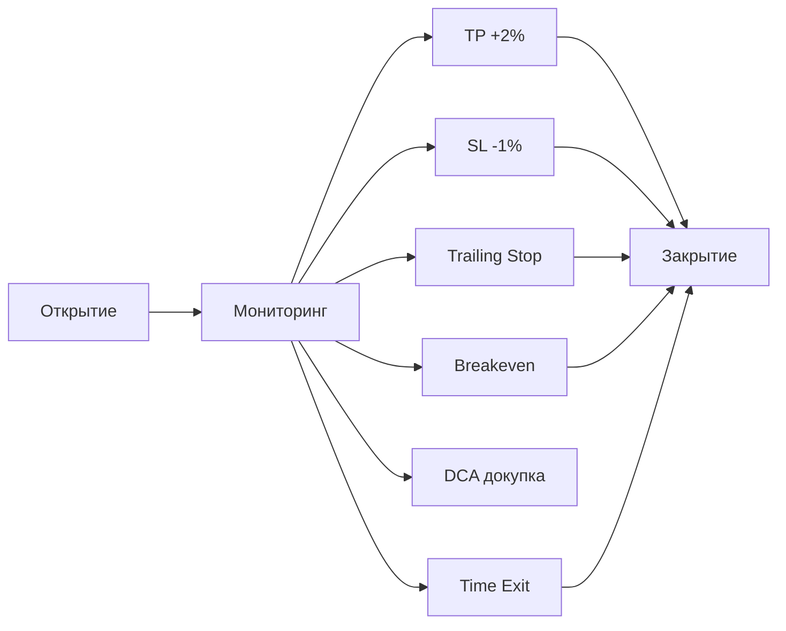

# Bybit Trading Bot — Полная документация проекта

> **Последнее обновление:** 2026-01-06 v1.9.0


## 📋 Обзор

Автоматизированный торговый бот для **спотовой торговли на Bybit** с AI-анализом через Perplexity.

| Параметр | Значение |
|----------|----------|
| **Язык** | Python 3.12+ |
| **Биржа** | Bybit Testnet (спот) |
| **AI** | Perplexity API (модель Sonar) |
| **Интерфейс** | Telegram Bot |
| **БД** | SQLite (`data/bot.db`) |
| **Сервер** | 217.12.37.42:58291 (root) |

### Что делает бот:
1. **Мониторит** фиксированные пары (BTC, ETH, SOL) + динамические (Top Gainers)
2. **Pre-filter**: Python анализ (RSI, Volume) — бесплатно
3. **AI анализ**: Perplexity API для топ-2 кандидатов — платно
4. **Авто-вход**: если score ≥ 80 и все риск-лимиты в норме
5. **Защита позиций**: TP/SL ордера, Trailing Stop, Breakeven, Time Exit
6. **Пирамидинг**: первоначальный вход 65%, докупка при -0.5%
7. **Smart DCA**: докупка при просадке -1.5% с учётом AI-анализа
8. **Auto-SL**: автоматическое создание SL для незащищённых позиций
9. **Спот-Фьючерс Арбитраж**: авто-funding через SHORT фьючерсов

---

## 📁 Структура проекта

```
bybit_bot/
├── bot/                          # Основная логика бота
│   ├── main.py                   # Точка входа, стартовые проверки
│   ├── controller.py             # Планировщик задач (APScheduler)
│   ├── perplexity_client.py      # AI-анализ через Perplexity
│   ├── ollama_client.py          # AI-анализ через Ollama (локально) **NEW**
│   ├── llm_router.py             # Маршрутизатор LLM провайдеров **NEW**
│   ├── error_tracker.py          # Трекинг ошибок (в памяти)
│   │
│   ├── services/                 # Бизнес-логика
│   │   ├── analysis_service.py   # AI анализ + принятие решений
│   │   ├── trading_service.py    # Открытие позиций, TP/SL, DCA
│   │   ├── position_service.py   # Закрытие, Trailing, Breakeven, Auto-SL
│   │   ├── balance_service.py    # Балансы USDT и монет
│   │   ├── prefilter_service.py  # Технический pre-filter (RSI, Volume)
│   │   ├── indicators_service.py # Индикаторы (RSI, Volume, ATR)
│   │   ├── scanner_service.py    # Сканер Top Gainers (динамические пары)
│   │   ├── arbitrage_service.py  # Спот-Фьючерс арбитраж (**NEW**)
│   │   ├── stats_service.py      # Статистика PnL
│   │   ├── chart_service.py      # Генерация графиков
│   │   └── websocket_service.py  # Цены в реальном времени (WS)
│   │
│   ├── db/                       # Работа с базой данных
│   │   ├── connection.py         # SQLite подключение (thread-safe)
│   │   ├── trades_repo.py        # Сделки, ордера, позиции
│   │   ├── pnl_repo.py           # История PnL
│   │   └── llm_requests_repo.py  # Логи запросов к Perplexity
│   │
│   └── telegram_client/          # Telegram интерфейс
│       ├── bot.py                # Инициализация бота
│       ├── handlers.py           # Обработчики команд и кнопок
│       ├── keyboards.py          # Клавиатуры (Reply + Inline)
│       └── formatters.py         # Форматирование сообщений
│
├── config/                       # Конфигурация
│   ├── settings.py               # Основные настройки из .env
│   ├── api_config.py             # API ключи
│   └── trading_config.py         # Параметры торговли
│
├── data/
│   └── bot.db                    # SQLite база данных
│
├── logs/
│   └── bot.log                   # Логи бота
│
├── .env                          # Переменные окружения (НЕ в git)
├── run_bot.sh                    # Скрипт запуска
└── stop_bot.sh                   # Скрипт остановки
```

---

## � Ключевые сервисы и методы

### `controller.py` — Планировщик задач

| Задача | Интервал | Метод | Описание |
|--------|----------|-------|----------|
| check_signals | 5 мин | `_check_signals()` | Pre-filter → AI анализ → вход |
| update_balances | 1 мин | `_update_balances()` | Обновление балансов |
| check_tpsl | 10 сек | `_check_tpsl()` | Проверка TP/SL |
| update_prices | 30 сек | `_update_positions_prices()` | Обновление цен |
| trailing_stop | 30 сек | `_update_trailing_stops()` | Подтяжка SL |
| check_breakeven | 30 сек | `_check_breakeven()` | Breakeven при +1% |
| check_time_exit | 5 мин | `_check_time_exit()` | Закрытие мёртвых позиций |
| check_dca | 2 мин | `_check_dca()` | Smart DCA |
| **auto_sl** | 2 мин | `_auto_create_missing_sl()` | Авто-создание SL |
| update_pairs | 1 час | `_update_market_pairs()` | Сканер Top Gainers |
| reset_daily | 00:00 | `_reset_daily_limits()` | Сброс лимитов |

### `position_service.py` — Управление позициями

| Метод | Описание |
|-------|----------|
| `close_position(id, reason)` | Закрыть позицию (с проверкой баланса) |
| `update_trailing_stops()` | Подтяжка SL при прибыли > 1% |
| `check_breakeven()` | Перенос SL на вход при прибыли ≥ 1% |
| `check_time_exit()` | Закрытие позиций старше N часов |
| `auto_create_missing_sl()` | **НОВОЕ**: Авто-создание SL для позиций без защиты |
| `_format_qty(pair, qty)` | Форматирование qty (правильные decimals) |
| `_get_actual_balance(pair)` | Проверка реального баланса на бирже |

### `trading_service.py` — Торговля

| Метод | Описание |
|-------|----------|
| `open_position(pair, analysis)` | Открыть позицию с TP/SL |
| `add_to_position(id, analysis)` | Smart DCA — докупка |
| `check_risk_limits()` | Проверка всех риск-лимитов |
| `_place_tp_sl_orders()` | Размещение TP/SL ордеров |
| `_get_qty_precision(pair)` | Получить точность qty для пары |

### `prefilter_service.py` — Технический фильтр (бесплатно)

| Метод | Описание |
|-------|----------|
| `scan_and_filter(pairs, top_n)` | Фильтрация пар по RSI/Volume |
| `calculate_score(pair)` | Расчёт технического score |

### `scanner_service.py` — Сканер Top Gainers
| Метод | Описание |
|-------|----------|
| `get_top_gainers(limit)` | Найти топ-N монет по росту (1.5-100%) и объему (>1M) |
| **Logic Memory** | Сохраняет пары в мониторинге на 24 часа (в контроллере) |

---

##  Сканер Top Gainers (динамические пары)

### Как работает:
1. **Сканер** запускается каждый час + при старте бота.
2. Получает с Bybit список **Top Gainers** (рост > 1.5%, объем > 1M$).
3. **24-часовая память**: если монета попала в Топ-5, она остается в списке мониторинга на 24 часа.
4. Ограничение списка до 10 активных динамических пар.
5. Обновляет подписки WebSocket.

### Путь монеты из Top Gainers:

```
СКАНЕР находит монету → dynamic_pairs
       ↓
CHECK_SIGNALS (каждые 5 мин)
       ↓
PRE-FILTER: RSI + Volume (бесплатно)
       ↓
Топ-2 кандидата → AI АНАЛИЗ (Perplexity)
       ↓
Score ≥ 80 → ОТКРЫТИЕ ПОЗИЦИИ с TP/SL
       ↓
МОНИТОРИНГ: Trailing, Breakeven, DCA, Time Exit
```

### Отображение в Telegram:
```
🎯 Отслеживаемые пары:
📌 Fix: BTCUSDT, ETHUSDT, SOLUSDT    ← Фиксированные
🚀 Top: AVAXUSDT, LINKUSDT           ← Динамические (от сканера)
```

> **Если Top: (нет)** — сканер работает, но не нашёл подходящих монет (рынок спокойный)

---

## �💾 Схема базы данных

### Таблицы

| Таблица | Назначение |
|---------|------------|
| `positions` | Открытые/закрытые позиции |
| `orders` | Ордера (entry, TP, SL) |
| `trades` | Исполненные сделки |
| `pnl_history` | История PnL по дням/парам |
| `llm_requests` | Логи запросов к Perplexity |
| `settings` | Настройки бота (scanner_enabled, auto_trading) |

### positions

| Поле | Тип | Описание |
|------|-----|----------|
| `id` | INTEGER PK | ID позиции |
| `pair` | TEXT | Торговая пара (BTCUSDT) |
| `entry_price` | REAL | Цена входа |
| `quantity` | REAL | Количество монет |
| `tp_price` | REAL | Take Profit |
| `sl_price` | REAL | Stop Loss |
| `status` | TEXT | OPEN / CLOSED |
| `current_price` | REAL | Текущая цена |
| `unrealized_pnl` | REAL | Нереализованный PnL |
| `avg_entry_price` | REAL | Средняя цена (после DCA) |
| `dca_count` | INTEGER | Количество DCA |
| `breakeven_activated` | INTEGER | Флаг breakeven |

### orders

| Поле | Тип | Описание |
|------|-----|----------|
| `order_id` | TEXT PK | ID ордера на бирже |
| `pair` | TEXT | Торговая пара |
| `side` | TEXT | Buy / Sell |
| `order_type` | TEXT | Market / Limit |
| `price` | REAL | Цена ордера |
| `quantity` | REAL | Количество |
| `status` | TEXT | New / Filled / Cancelled |
| `is_tp` | INTEGER | Флаг Take Profit |
| `is_sl` | INTEGER | Флаг Stop Loss |
| `position_id` | INTEGER FK | Связь с позицией |

---

## ⚙️ Конфигурация (`config/trading_config.py`)

### Риск-менеджмент

| Параметр | Значение | Описание |
|----------|----------|----------|
| `MAX_RISK_PER_TRADE` | 0.5% | Риск на сделку |
| `MAX_TOTAL_RISK` | 5% | Общий риск |
| `MAX_DAILY_LOSS` | 3% | Дневной стоп-лосс |
| `MAX_OPEN_POSITIONS` | 5 | Макс. открытых позиций |
| `MAX_ACTIVE_PAIRS` | 3 | Макс. активных пар |
| `MAX_NEW_TRADES_PER_DAY` | 10 | Макс. сделок в день |

### TP/SL/Trailing

| Параметр | Значение |
|----------|----------|
| `DEFAULT_TP_PERCENT` | +2% |
| `DEFAULT_SL_PERCENT` | -1% |
| `TRAILING_ACTIVATION` | +1% |
| `TRAILING_STEP` | 0.5% |
| `BREAKEVEN_TRIGGER_PERCENT` | +1% |
| `BREAKEVEN_BUFFER` | +0.1% |

### ATR-based TP/SL (**NEW v1.5.0**)

| Параметр | Значение | Описание |
|----------|----------|----------|
| `ATR_BASED_TPSL_ENABLED` | True | Адаптивные уровни к волатильности |
| `ATR_PERIOD` | 14 | Период ATR |
| `ATR_TP_MULTIPLIER` | 3.0 | TP = ATR × 3 (R/R 1:3) |
| `ATR_SL_MULTIPLIER` | 1.0 | SL = ATR × 1 |

### Тренд-фильтр (**NEW v1.5.0**)

| Параметр | Значение | Описание |
|----------|----------|----------|
| `TREND_FILTER_ENABLED` | True | Не торговать против тренда |
| `TREND_EMA_FAST` | 20 | Быстрая EMA |
| `TREND_EMA_SLOW` | 50 | Медленная EMA |
| **Правило** | | LONG только если EMA20 > EMA50 |

### Пирамидинг (**NEW**)

| Параметр | Значение | Описание |
|----------|----------|----------|
| `PYRAMIDING_ENABLED` | True | Включить пирамидинг |
| `INITIAL_POSITION_PERCENT` | 65% | Первоначальный вход |
| `PYRAMIDING_TRIGGER` | -0.5% | Триггер для докупки |
| `PYRAMIDING_ADD_PERCENT` | 35% | Размер докупки |

### TIME EXIT

| Параметр | Значение | Описание |
|----------|----------|----------|
| `TIME_EXIT_ENABLED` | True | Включить автозакрытие |
| `MAX_POSITION_HOURS` | 8ч | Макс. время позиции (было 4ч) |
| `STALE_MOVE_THRESHOLD` | 0.5% | Мин. движение для удержания |

### DCA (Smart)

| Параметр | Значение |
|----------|----------|
| `DCA_ENABLED` | True |
| `DCA_TRIGGER_PERCENT` | -1.5% |
| `DCA_MAX_ENTRIES` | 3 |
| `DCA_MIN_SCORE` | 60 |
| `DCA_POSITION_MULTIPLIER` | 0.5 |

### Спот-Фьючерс Арбитраж (**NEW v1.6.0**)

| Параметр | Значение | Описание |
|----------|----------|----------|
| `ARBITRAGE_ENABLED` | True | Включить авто-арбитраж |
| `ARBITRAGE_CHECK_INTERVAL` | 3600 | Проверка каждый час (секунды) |
| `ARBITRAGE_MIN_FUNDING_RATE` | 0.0001 | Мин. funding rate (0.01%) |
| `ARBITRAGE_MAX_POSITIONS` | 3 | Максимум арбитражных позиций |
| `ARBITRAGE_POSITION_SIZE_USD` | 100 | Размер позиции в USDT |
| `ARBITRAGE_MIN_VOLUME_USDT` | 10M | Мин. объем для подбора пар |
| `ARBITRAGE_SCAN_LIMIT` | 50 | Лимит сканируемых пар |

### Perplexity

| Параметр | Значение |
|----------|----------|
| `MAX_LLM_COST_PER_MONTH` | $30 |
| `MAX_LLM_REQUESTS_PER_DAY` | 100 |
| Интервал анализа пары | 5 мин |

---

## 🤖 Telegram интерфейс

### Постоянная клавиатура (ReplyKeyboard)

| Кнопка | Действие |
|--------|----------|
| 📊 Анализ | Выбор пары → AI анализ → график |
| 📈 Отчёты | PnL по дням/парам, AI-отчёты |
| � Статус | Открытые позиции, балансы |
| ⚠️ Ошибки | Последние ошибки |
| ⚙️ Настройки | Пауза, авто-торговля, сканер |

---

## 🔄 Логика работы

### Цикл проверки сигналов



### Жизненный цикл позиции



---

## 🚀 Деплой

### Локально
```bash
cd /Users/lexa/Documents/Python/bybit_bot
source venv/bin/activate
python -m bot.main
```

### На сервер
```bash
# 1. Создать архив
zip -r deploy.zip bot/ config/ -x "*.pyc" -x "*__pycache__*"

# 2. Загрузить (scp)
expect -c 'spawn scp -P 58291 deploy.zip root@217.12.37.42:/root/bybit_bot/ ...'

# 3. Перезапустить
ssh -p 58291 root@217.12.37.42
cd /root/bybit_bot
pkill -f "python.*main.py"
unzip -o deploy.zip
./run_bot.sh
```

### Проверка логов
```bash
tail -50 /root/bybit_bot/logs/bot.log
grep ERROR /root/bybit_bot/logs/bot.log | tail -20
```

---

## ✅ История исправлений

### v1.9.0 (2026-01-06)
- ✅ **DCA Balance Check**: Добавлена проверка доступного USDT перед докупкой, исключает ошибку `Insufficient balance`.
- ✅ **Improved Rejection Logging**: `open_position` теперь возвращает `(position, error_message)`, детализируя причину отказа.
- ✅ **Controller Logging**: `_check_signals` логирует конкретную причину отказа (Trend Filter, Risk Limit, API Error).
- ✅ **Telegram Handlers**: Ручная покупка выводит точную ошибку при неудаче.
- ✅ **Full Redeploy**: Восстановлен `.venv` на сервере со всеми зависимостями.

### v1.8.0 (2026-01-04)
- ✅ **Advanced AI Prompt**: Добавлен Web Search (анализ новостей X/Twitter за 6 часов) и поле `LOGIC`.
- ✅ **LLM Limits**: Дневной лимит запросов увеличен до **100**, бюджет до **$30**.
- ✅ **Smart Scanner**: Добавлена фильтрация символов по доступности в среде (Testnet-only filtering).
- ✅ **Server Optimization**: Установлен `sqlite3` на сервер, исправлены зависимости `matplotlib` и `pandas`.
- ✅ **Improved Parsing**: Парсер Perplexity теперь обрабатывает многострочную логику и адаптирован под низкую температуру (0.2).

### v1.7.0 (2026-01-03)
- ✅ **LLM Router**: маршрутизатор между провайдерами AI (Perplexity / Ollama)
- ✅ **Ollama Client**: интеграция с локальной LLM (qwen2.5:1.5b)
- ✅ **HYBRID режим**: Perplexity + Ollama fallback
- ✅ Установлен Ollama на сервер (CPU-only)
- ✅ `LLM_PROVIDER_MODE` в config: PERPLEXITY_ONLY, LOCAL_ONLY, HYBRID, PREFER_LOCAL
- ✅ **Fix**: Заменено округление `round()` на `math.floor()` для `quantity` во всех сервисах.
- ✅ Исправлена ошибка `Insufficient balance` при закрытии позиций (из-за округления вверх).
- ✅ **Арбитраж**: Добавлен динамический сканер ликвидных пар (фильтрация по 24h объему и наличию на обоих рынках).
- ✅ **Торговый сканер**: Исправлен баг фильтрации (USD/USDT), добавлена 24-часовая "память" для трендовых монет.
- ✅ **Top Gainers**: Теперь бот мониторит топ-5 волатильных монет и сохраняет их в списке на сутки.

### v1.6.0 (2026-01-03)
- ✅ **Спот-Фьючерс Арбитраж**: автоматический заработок на funding rates
- ✅ **Авто-арбитраж**: сканирование и открытие каждый час
- ✅ **Telegram меню**: кнопка "Арбитраж" со сканером и управлением
- ✅ **БД**: таблица `arbitrage_positions`
- ✅ **Scheduler**: обновление funding в 0:00, 8:00, 16:00 UTC

### v1.5.0 (2026-01-02)
- ✅ **ATR-based TP/SL**: адаптивные уровни к волатильности (ATR×3 / ATR×1)
- ✅ **R/R 1:3**: улучшенное соотношение риск/прибыль
- ✅ **Тренд-фильтр**: не торгуем если EMA20 < EMA50
- ✅ **Position Sizing по AI Score**: размер × (score/80), от 0.5x до 1.2x
- ✅ Добавлен метод `calculate_atr()` в indicators_service

### v1.4.0 (2026-01-02)
- ✅ **Пирамидинг входа**: первоначальный вход 65%, докупка при -0.5%
- ✅ Исправлена ошибка `Order price has too many decimals (170134)` — метод `_format_price()`
- ✅ Исправлена ошибка `TradesRepository.get_db` — импорт из connection
- ✅ Отчёты PnL теперь записываются через единый метод `_close_position_with_pnl()`
- ✅ TIME EXIT увеличен до 8 часов (было 4)

### v1.3.0 (2025-12-30)
- ✅ Auto-SL теперь **синхронизирует qty в БД** с реальным балансом биржи
- ✅ При `Insufficient balance` — позиция автоматически **закрывается в БД**
- ✅ Добавлен метод `update_position_quantity()` в trades_repo
- ✅ Подробная документация Top Gainers сканера

### v1.2.0 (2025-12-30)
- ✅ `auto_create_missing_sl()` — автоматическое создание SL для незащищённых позиций
- ✅ Постоянная клавиатура Telegram (`ReplyKeyboardMarkup`)

### v1.1.0 (2025-12-30)
- ✅ Исправлена ошибка `Insufficient balance (170131)` — проверка баланса перед продажей
- ✅ Исправлена ошибка `Order quantity has too many decimals (170137)` — метод `_format_qty()`
- ✅ Увеличен `recv_window` до 20000 (Read timeout)
- ✅ Добавлена проверка `scheduler.running` перед остановкой

---

## 🔧 API интеграции

| API | Назначение | Эндпоинт |
|-----|------------|----------|
| Bybit REST | Балансы, ордера | `api-testnet.bybit.com/v5/*` |
| Bybit WS | Цены реалтайм | `stream-testnet.bybit.com/v5/public/spot` |
| Perplexity | AI-анализ | `api.perplexity.ai/chat/completions` |
| Telegram | Интерфейс | Bot API |

---

## 🔑 Переменные окружения (.env)

```env
# Bybit
BYBIT_API_KEY=...
BYBIT_API_SECRET=...

# Perplexity
PERPLEXITY_API_KEY=...

# Telegram
TELEGRAM_BOT_TOKEN=...
TELEGRAM_CHAT_ID=...
```
